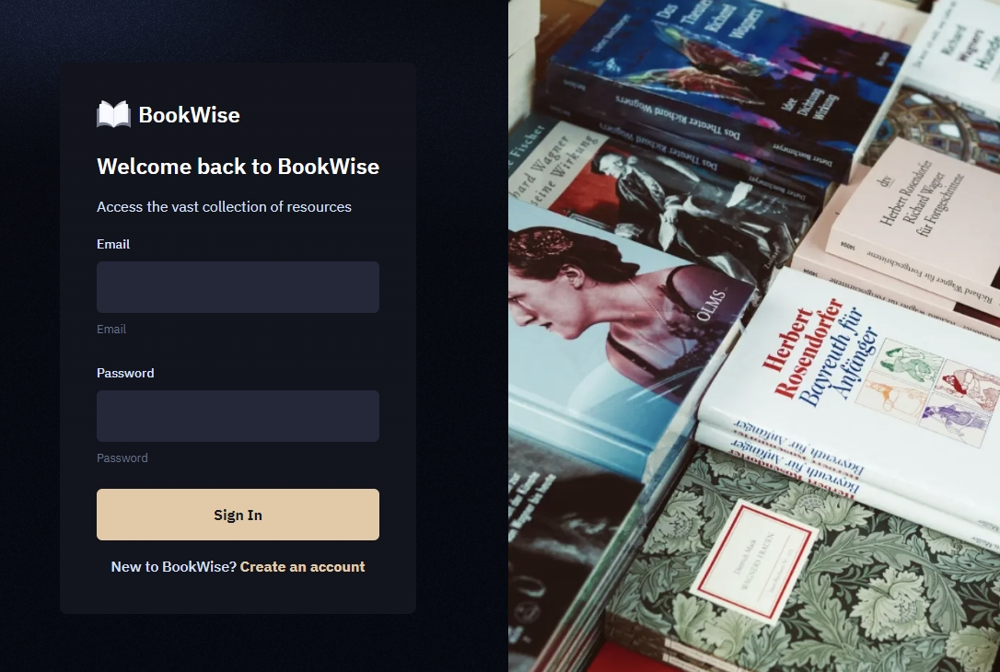
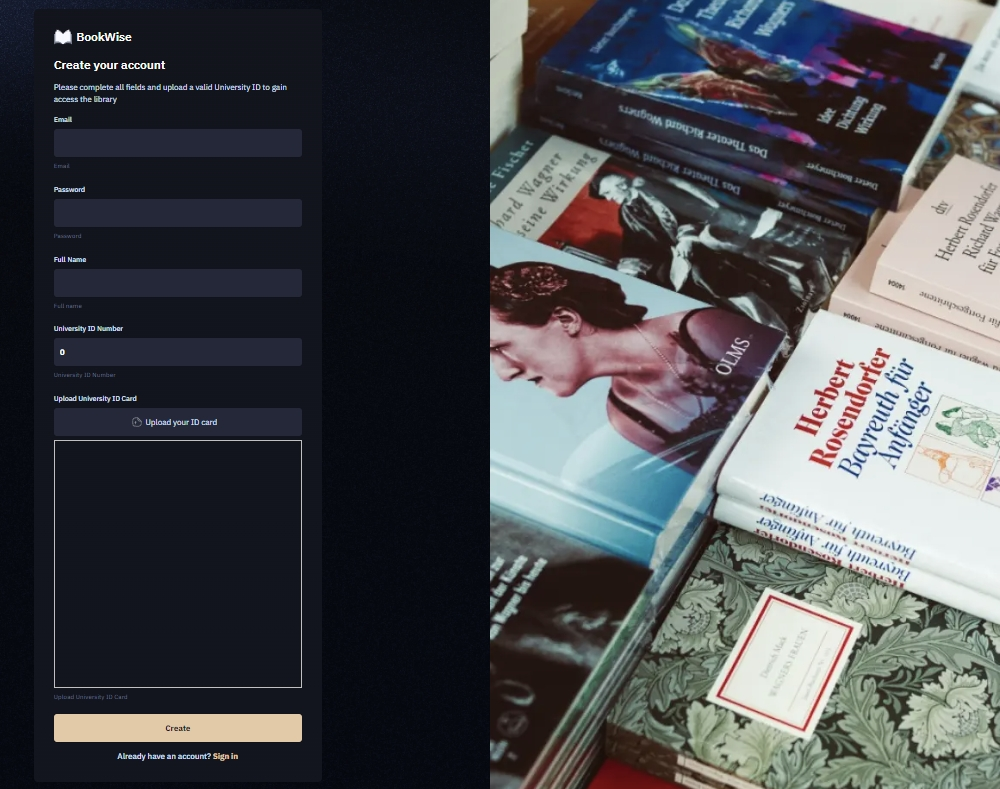
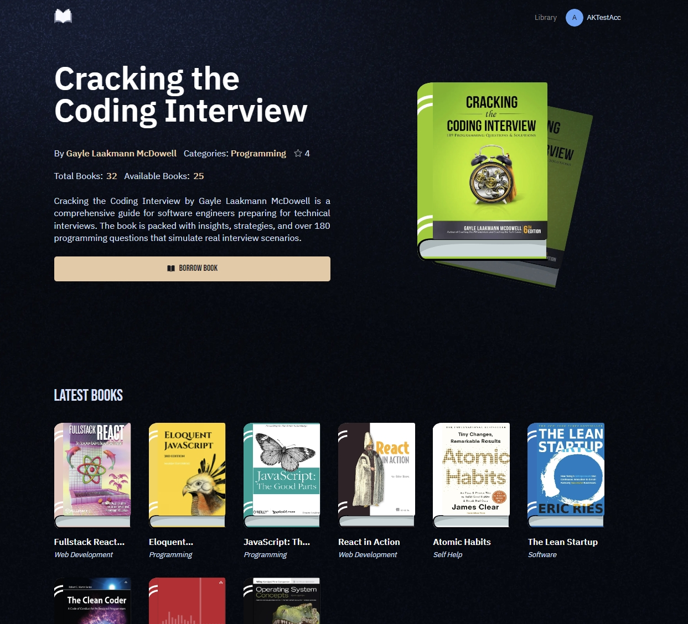
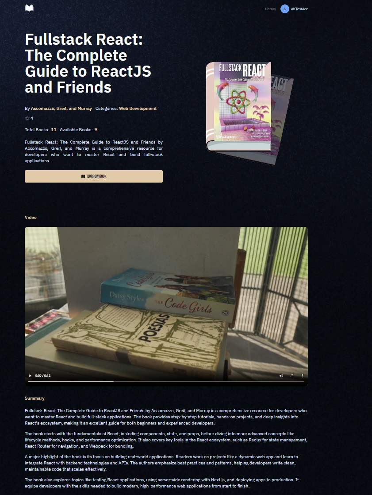
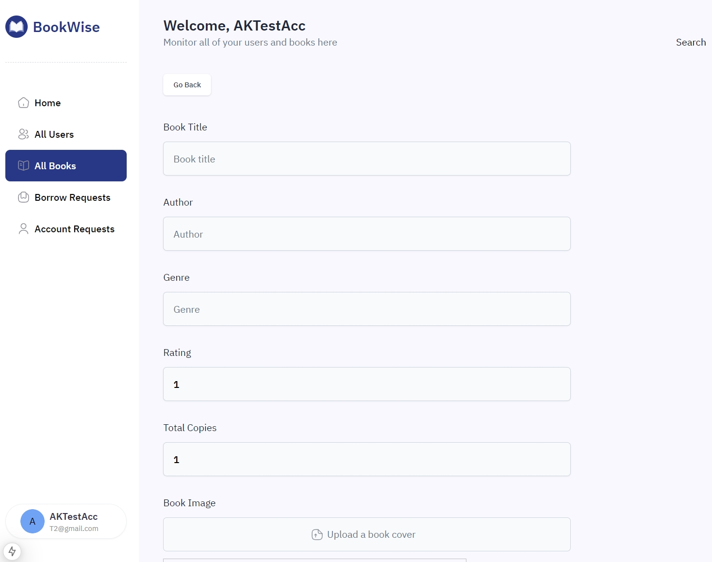

# University Library Management System Web App
  

    
    
    
    
    
  

## 📋 Overview
This is a Full-Stack web application using NextJS, React framework for dynamic client-side front-end.

Click here to check out! [Univ-Lib System](https://univ-library-rust.vercel.app/)

|Sign in|Sign up|
|:-:|:-:|
|||

|Home Page|Details|
|:-:|:-:|
|||

|Admin|
|:-:|
||

## ⚙️ Tech Stack

- Next.js
- PostgreSQL
- Upstash
- ImageKit
- TypeScript
- Resend
- Tailwind CSS

## 🔋 Features

- Home Page: Highlighted books and newly added books with 3D effects.
- Library Page: Advanced filtering, search, and pagination for book discovery.
- Book Detail Page: Availability tracking, book summaries, videos, and suggestions for similar books.
- Borrow Book: Automatically checks available copies and generates due dates.
- Role Management: Change user roles to invite more admins.
- Database Management: PostgreSQL with Neon for scalable and collaborative database handling.
- Real-time Media Processing: ImageKit for image and video optimization and transformations.
- Efficient Caching: Upstash Redis for caching, workflows, and triggers.
- Morden UI/UX: Built with TailwindCSS, ShadCN, and other cutting-edge tools.
